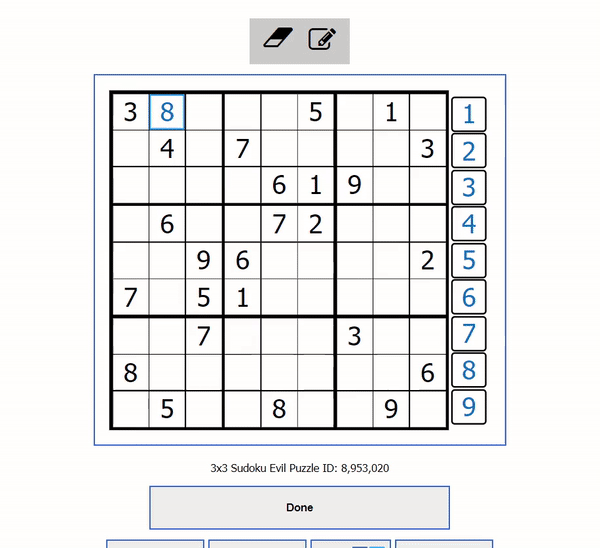
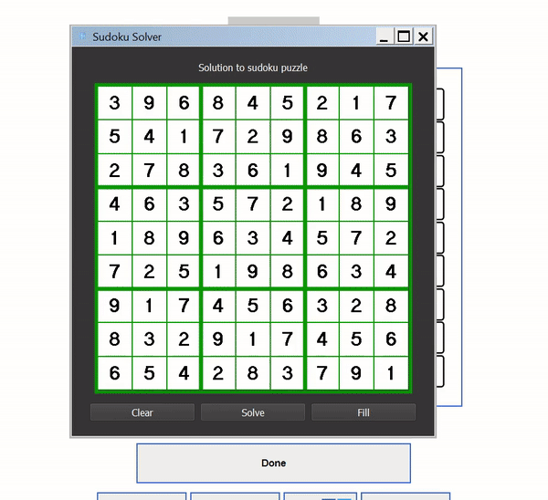

# Sudoku Solver

The Sudoku Solver is a Python GUI App that automatically reads the contents of a sudoku on the screen of the user,
and solves that sudoku using a mixture of both heuristic approaches and recursive bifurcations. To use, drag the GUI
over the sudoku you want to solve on the screen of your device, and resize the GUI such that the sudoku fits perfectly 
inside the window of the GUI. Ensure that there aren't any numbers outside of the sudoku puzzle that appear in the 
window. Then, press the 'Solve' button. The app will take a few seconds to read the sudoku board within its window,
and once read, it will automatically compute the solution to the sudoku board, if it exists. If the sudoku puzzle
has a valid solution and the app has found it, the 'Fill' will become active. Pressing 'Fill' will then allow the GUI
to automatically fill in the sudoku on screen. Press 'Clear' anytime to reset the app and allow capture and solve of
another sudoku puzzle.

### Demo

Show a valid Board

Show an invalid Board

Show autofill functionality

___
### Dependencies and Installation
- Install tesseract [here](https://github.com/UB-Mannheim/tesseract/wiki) (for OCR)
- OpenCV
- PyQT5
- Numpy
- PyInstaller
- PyAutoGUI
- PyTesseract
- Imutils

___
### Bugs List
- Stop crashing when reading invalid board
- Detect an invalid board when reading in
___
### Credits and Resources
- PyQT Examples [here](https://github.com/pyqt/examples), [here](https://wiki.python.org/moin/PyQt/Tutorials), and [here](http://zetcode.com/gui/pyqt5/firstprograms/)
- [PyAutoGUI help with masking widgets](https://stackoverflow.com/questions/57717331/is-it-possible-to-create-qmainwindow-with-only-outer-border)
- [PyAutoGUI adjusting transparency of QWindow](https://www.geeksforgeeks.org/pyqt5-how-to-create-semi-transparent-window/#:~:text=When%20we%20design%20an%20application,belongs%20to%20the%20QWidget%20class%20.)
- [Reading and parsing squares in sudoku](https://stackoverflow.com/questions/59182827/how-to-get-the-cells-of-a-sudoku-grid-with-opencv)
- [Sudoku puzzle website](https://www.puzzle-sudoku.com/)
- [Sudoku techniques website](https://www.sudokuwiki.org/sudoku.htm)