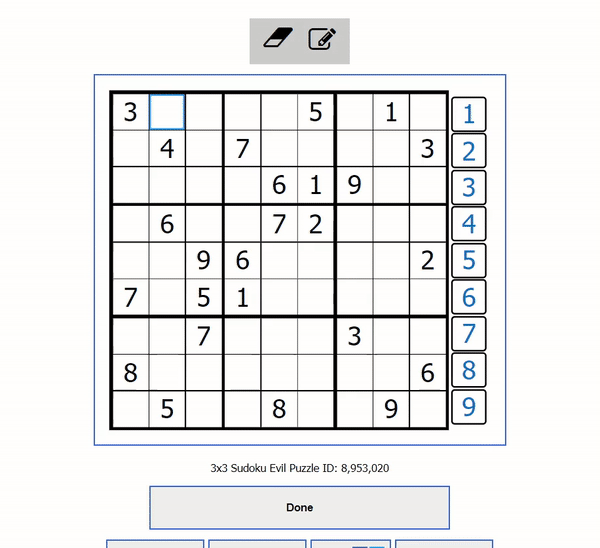
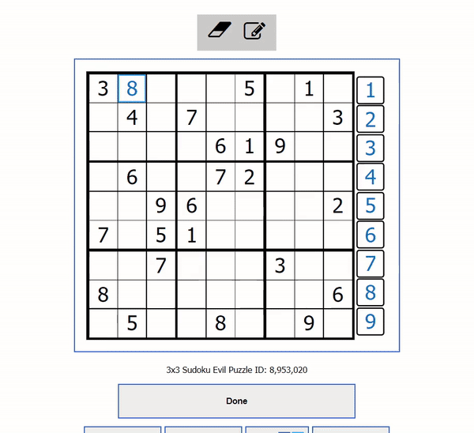
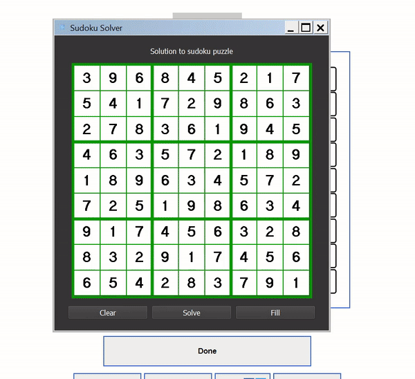

# Sudoku Solver GUI

Insert text here for what this is

### Demo

Show a valid Board

Show an invalid Board

Show autofill functionality

___
### Dependencies and Installation
- Install tesseract [here](https://github.com/UB-Mannheim/tesseract/wiki) (for OCR)
- OpenCV
- PyQT5
- Numpy
- PyInstaller
- PyAutoGUI
- PyTesseract
- Imutils

___
### Bugs List
- Stop crashing when reading invalid board
- Detect an invalid board when reading in
___
### Credits and Resources
- PyQT Examples [here](https://github.com/pyqt/examples), [here](https://wiki.python.org/moin/PyQt/Tutorials), and [here](http://zetcode.com/gui/pyqt5/firstprograms/)
- [PyAutoGUI help with masking widgets](https://stackoverflow.com/questions/57717331/is-it-possible-to-create-qmainwindow-with-only-outer-border)
- [PyAutoGUI adjusting transparency of QWindow](https://www.geeksforgeeks.org/pyqt5-how-to-create-semi-transparent-window/#:~:text=When%20we%20design%20an%20application,belongs%20to%20the%20QWidget%20class%20.)
- [Reading and parsing squares in sudoku](https://stackoverflow.com/questions/59182827/how-to-get-the-cells-of-a-sudoku-grid-with-opencv)